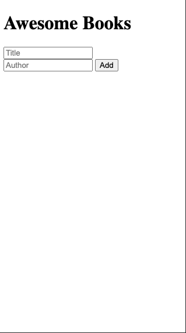

# Awesome Books

> A Simple Program Designed to Orgamise all our Literature.



- A User can Add a book using a form.
- Get tired of a book, you can as well remove all togsther from the list.

## Built With

- HTML, CSS and Javascript

## Live Demo

[Live Demo Link](https://emmyobonyo.github.io/Awesome-Books/)


## Getting Started

To get a local copy up and running follow these simple example steps.

### Prerequisites
- A Computer, I guess and internet connection.

### Install
- Navigate to a directory on your computer where you'd like to store the project and type ```git clone https://github.com/emmyobonyo/Awesome-Books.git```
- Look for the ```index.html``` file and open it in your favourite browser.
- Start storing your Awesome Books away.
- You're Welcome

## Authors

👤 **Yahya EL Ganayni**

- GitHub: [@githubhandle](https://github.com/yahyaelganyni1 )
- Twitter: [@twitterhandle](https://twitter.com/@crazy20046)
- LinkedIn: [LinkedIn](https://www.linkedin.com/in/yahya-el-ganayni-a456115b/)

👤 **Author2**

- GitHub: [@githubhandle](https://github.com/emmyobonyo)
- Twitter: [@twitterhandle](https://twitter.com/emmyobonyo)
- LinkedIn: [LinkedIn](https://www.linkedin.com/in/emmanuel-obonyo-3728a2200/)

## 🤝 Contributing

Contributions, issues, and feature requests are welcome!

## Show your support

Give a ⭐️ if you like this project!

## Acknowledgments

- Thanks to [Microverse](https://microverse.org/) for providing the linters

## 📝 License

This project is MIT licensed.
